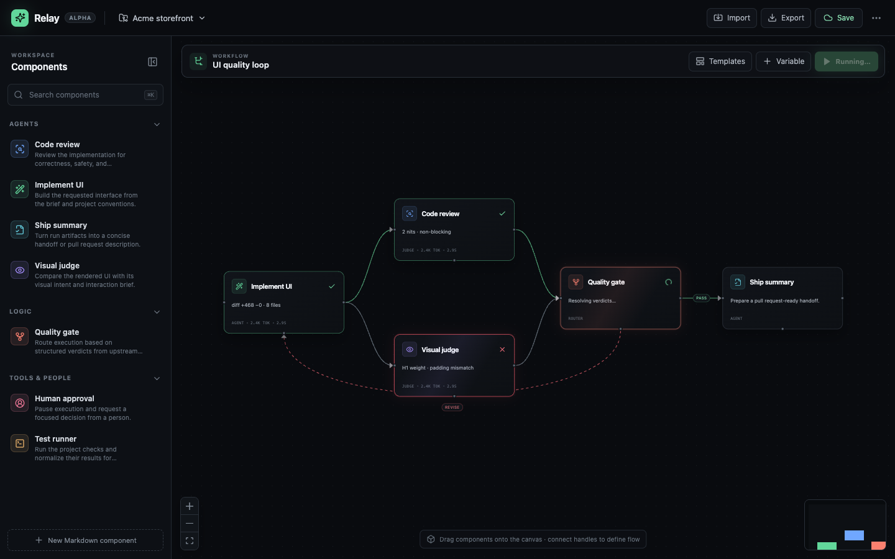

# Agent Management

**Relay** is a visual, file-first workspace for composing reusable agent instructions into auditable workflows.

The board is the editor. Markdown files are the source of truth. A workflow connects agents, judges, tools, decision gates, and human approvals; project bindings customize those components without forking their shared instructions.



## What is working

- Draggable, connectable workflow canvas with zoom, pan, minimap, and deletion
- Seven Markdown-backed starter components in [`components/`](components)
- Parallel review branches, labeled decision routes, and a visible revision loop
- Per-node instruction overrides plus project-level variables
- Local save and portable JSON import/export
- Simulated execution states that demonstrate a failed visual review and retry
- A typed workflow document model ready for a real runner

This first version deliberately simulates execution. It proves the authoring model and interaction design before coupling the product to a specific agent runtime.

## Run locally

```bash
pnpm install
pnpm dev
```

Then open `http://localhost:5173`.

```bash
pnpm lint
pnpm build
```

## The core idea

A component is a versioned Markdown instruction with metadata and an input/output contract:

```md
---
id: visual-judge
name: Visual judge
kind: judge
inputs: screenshot, brief
outputs: verdict, visual_findings
---

Inspect the rendered result at `{{preview.url}}`...
```

A workflow references that component and adds only instance-specific configuration. At run time, Relay compiles the final instruction using this precedence:

```text
component defaults
  → workspace profile
    → project context
      → workflow node overrides
        → run inputs
```

That makes reuse practical: improving `visual-judge.md` improves every workflow that accepts the new version, while a project can still define its own preview URL, commands, tolerance, repository instructions, and task.

## Repository map

```text
components/             Reusable Markdown component definitions
workflows/              Portable saved workflow documents
src/components/         Canvas, node, edge, library, and inspector UI
src/data/library.ts     Markdown discovery and frontmatter parsing
src/types/workflow.ts   Typed component and workflow contracts
docs/PRODUCT.md         Product thesis, primitives, and roadmap
docs/ARCHITECTURE.md    Execution model and technical boundaries
docs/workflow.schema.json
```

## Design principles

1. **Files over hidden configuration.** Components and workflows should diff, review, branch, and merge with the project.
2. **Composition over giant prompts.** Small instructions with explicit contracts are easier to test and reuse.
3. **Control flow must be inspectable.** Branch conditions, loop limits, and human pauses are visible—not buried in prose.
4. **Artifacts are first-class.** Patches, screenshots, findings, and approvals travel on edges and remain attached to a run.
5. **Execution is replaceable.** The workflow format should compile to local Codex/Claude tooling, CI, or a hosted runner without changing the board.

## Next build slice

The next milestone is a local execution daemon: resolve Markdown components, validate variables, execute ready nodes concurrently, persist artifacts/events, and enforce loop limits. See [Product framework](docs/PRODUCT.md) and [Architecture](docs/ARCHITECTURE.md).

## License

MIT
