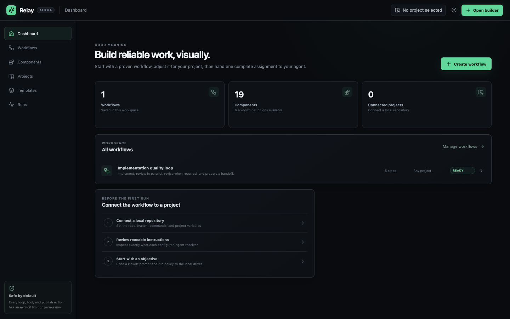
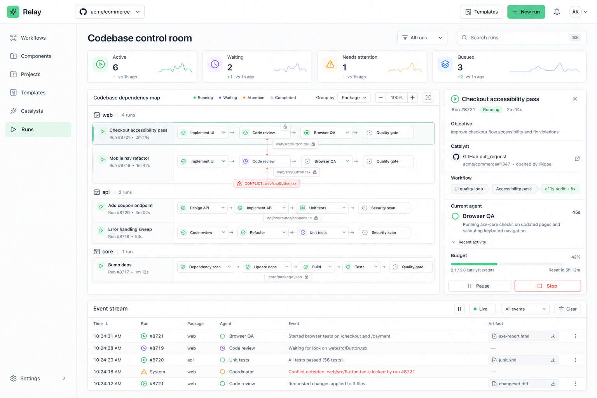

# Agent Management

**Relay** is a visual, file-first workspace for composing reusable agent instructions into auditable workflows.

The board is the editor. Markdown files are the source of truth. A workflow connects agents, judges, tools, decision gates, and human approvals; project bindings customize those components without forking their shared instructions.



## What is working

- Draggable, connectable workflow canvas with zoom, pan, minimap, and deletion
- Nineteen Markdown-backed components in [`components/`](components), including repository mapping, project checks, browser QA, migration review, dependency audit, documentation sync, integration review, and cross-repository impact
- Parallel review branches, labeled decision routes, and a visible revision loop
- Selectable transitions with independent triggers, payload routing, delay, blocked behavior, priority, and loop policy
- Explicit Catalyst start components for hook-, connector-, schedule-, or query-initiated workflows; graphs without one remain manually started
- Per-node instruction overrides plus project-level variables
- Per-node model, reasoning-effort, and tool overrides with visible inherited values
- A project configuration surface for directory, branch, runtime defaults, tool allowlists, permissions, and variables
- Local save and portable JSON import/export
- Defensive browser persistence that recovers from malformed or unavailable local storage
- Bounded, schema-aware workflow imports that reject duplicate nodes and broken edge references
- Dashboard pages for workflows, components, projects, templates, and live runs
- Driver-ready `.relay.json` assignment bundles with embedded Markdown and execution policies
- Split-view control room for graph state and parallel agent lanes
- User-arranged multi-run boards with codebase sections, honest connection states, and draggable workflow tiles
- Catalyst authoring for signed hooks, connector events, runner cron, and secure queries
- Saved workflows exposed as reusable nested-workflow nodes
- Task-first run preparation with guided, adaptive, and full-autonomous modes, optional budgets, and explicit CLI handoff
- Keyboard-safe dialogs, component search, monitor reordering, and recoverable tile removal
- Persistent dark and light themes
- Seven built-in workflow templates plus persisted user templates with private/published visibility
- Template-to-builder handoff that instantiates the selected components and transitions on the canvas
- Guided component creation with role, icon, accent, live board preview, and optional contracts
- Simulated execution states that demonstrate a failed visual review and retry
- A typed workflow document model ready for a real runner

This version implements authoring, handoff, persisted workflow/template catalogs, and the live-observation contract. Until a Relay CLI is connected, the Runs page stays in an honest waiting or empty state rather than fabricating execution data.

## Run locally

```bash
pnpm install
pnpm dev
```

Then open `http://localhost:5173`.

```bash
pnpm lint
pnpm build
```

## The core idea

A component is a versioned Markdown instruction with metadata and an input/output contract:

```md
---
id: visual-judge
name: Visual judge
kind: judge
inputs: screenshot, brief
outputs: verdict, visual_findings
---

Inspect the rendered result at `{{preview.url}}`...
```

A workflow references that component and adds only instance-specific configuration. At run time, Relay compiles the final instruction using this precedence:

```text
component defaults
  → workspace profile
    → project context + runtime defaults
      → workflow node prompt/model/tool overrides
        → run inputs and temporary policy
```

That makes reuse practical: improving `visual-judge.md` improves every workflow that accepts the new version, while a project can still define its own preview URL, commands, tolerance, repository instructions, and task.

## Repository map

```text
components/             Reusable Markdown component definitions
workflows/              Portable saved workflow documents
src/components/         Canvas, node, edge, library, and inspector UI
src/data/library.ts     Markdown discovery and frontmatter parsing
src/lib/storage.ts      Safe local persistence boundary
src/lib/validation.ts   Runtime workflow and assignment import validation
src/types/workflow.ts   Typed component and workflow contracts
docs/PRODUCT.md         Product thesis, primitives, and roadmap
docs/ARCHITECTURE.md    Execution model and technical boundaries
docs/DRIVER-PROTOCOL.md Driver handoff, event stream, and live UI contract
docs/workflow.schema.json
docs/assignment.schema.json
```

## Design principles

1. **Files over hidden configuration.** Components and workflows should diff, review, branch, and merge with the project.
2. **Composition over giant prompts.** Small instructions with explicit contracts are easier to test and reuse.
3. **Control flow must be inspectable.** Branch conditions, loop limits, and human pauses are visible—not buried in prose.
4. **Artifacts are first-class.** Patches, screenshots, findings, and approvals travel on edges and remain attached to a run.
5. **Execution is replaceable.** The workflow format should compile to local Codex/Claude tooling, CI, or a hosted runner without changing the board.

## Next build slice

The next milestone is a local execution daemon: resolve Markdown components, validate variables, execute ready nodes concurrently, persist artifacts/events, and stream live state to the Runs control room. See [Product framework](docs/PRODUCT.md), [Architecture](docs/ARCHITECTURE.md), and [Driver protocol](docs/DRIVER-PROTOCOL.md).



## License

MIT
